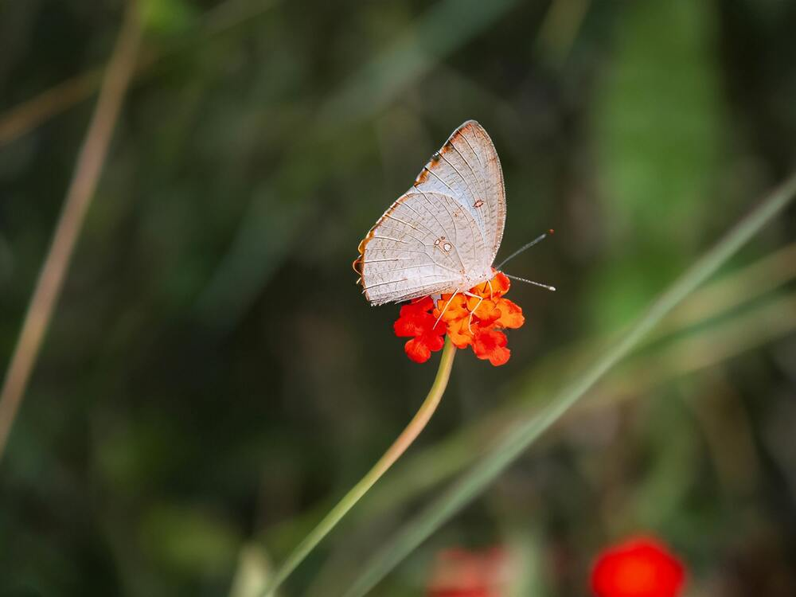

+++
title = "Biodiversität in Gefahr"
date = "2024-06-11"
draft = true
pinned = false
tags = ["biodiversität", "artenvielfalt", "reportage"]
image = "pexels-mhshan7-17693619-1-.jpg"
+++

*Jede einzelne Tier- und Pflanzenart trägt etwas zur Balance der Natur bei, die unsere Lebengrundlage bildet. Dieses Gleichgewicht wird durch den Menschen gestört. Unsere Reportage zeigt auf, warum und wie wir handeln können und müssen, um die Biodiversität in der Schweiz zu erhalten.*

“Als ich in eurem Alter war, da sahen wir noch mehr und andere Tagfalter- und Schmetterlingsarten im Mittelland \[…], das hat massiv abgenommen”, er-zählt uns Claudio Niggli, Biologe und Beerenexperte. Die Vielfalt der Pflanzen-, Tier- und Pilzarten in der Schweiz ist in einem schlechten Zustand. Immer wieder sterben einzelne Arten aus, was sich auf ganze Ökosysteme, in denen wir leben und von denen wir abhängig sind, auswirkt. Dabei wird die Abnahme dieser Artenvielfalt oder Biodiversität durch viele verschiedene Faktoren beeinflusst. Ziel muss es sein, sorgfältig mit unserer natürlichen Umgebung und der Vielfalt an Lebewesen umzugehen. Nur scheint es schwierig, Ziele wie diese in Einklang mit den sonstigen Interessen der Gesellschaft zu bringen. Wir sind der Problematik auf den Grund gegangen.

### **Begriff Biodiversität**

Biodiversität ist ein Thema, welches in den letzten Jahren immer präsenter wurde. Der Begriff Biodiversität setzt sich aus drei Ebenen zusammen: die Vielfalt der Arten, die genetische Viel-falt und die Vielfalt der Lebensräume. Alle drei Bereiche sind dabei entschei-dend und spielen zusammen. Die Viel-falt der Arten beschreibt die Breite an verschiedenen Tier-, Pflanzen- und Pilzarten, die genetische Vielfalt die Breite an unterschiedlichen Variationen einer Art, die sich je nach Lebensraum anders angepasst und entwickelt hat und die Vielfalt der Lebensräume die Breite an Lebensräumen wie Auen, Moore, Wälder oder Gebirge, die den Lebewesen als Grundlage dienen. Die Biodiversität gehört zu komplexen Sys-temen in der Natur mit Wechselwir-kungen zwischen den Lebewesen, auch bekannt als Ökosysteme. Nur schon das Aussterben einer Art kann ein Ökosys-tem aus dem Gleichgewicht bringen. Diese Biodiversität mit allen drei Ebe-nen hat für den Menschen unzählige Funktionen und beeinflusst uns direkt. Claudio zählt während eines Interviews einige dieser Funktionen auf. Der Mitarbeiter der Stiftung Pro Specie Rara, der sich für die Erhaltung der kulturellen Artenvielfalt einsetzt, hat uns im Gymnasium Kirchenfeld für ein Gespräch besucht. Er nennt die Vielfalt unserer Nahrung, die durch die Biodiversität beeinflusst wird, die Bedeutung für die Medizin, denn die meisten Medikamente können nur aufgrund der vielfältigen Natur entwickelt werden, die Wasserreinigung durch unter-schiedliche Pflanzenarten, die Verbesserung der Luftqualität durch Wälder und Moore und auch das Naturerlebnis für uns Menschen, das stark beeinflusst wird. Zusammengefasst bildet die Biodiversität die Lebensgrundlage für den Menschen auf diesem Planeten. 

### **Stand heute und wie es dazu kam**

Die Biodiversität in der Schweiz geht seit 1900 kontinuierlich zurück und ist momentan in einer schlechten Verfassung. Flächen, auf denen Biodiversität Priorität hat, schrumpfen weiterhin und immer wieder sterben gewisse Arten aus oder sind vom Aussterben bedroht. Das Artensterben begann vor allem im Mittelland und setzte sich bis zu den Voralpen fort. Doch wie kam es zu die-ser Situation? 
Um 1900, zur Zeit der Industrialisie-rung, begann der Mensch sich auszu-breiten. Im Laufe des Jahrhunderts werden durch Vergrösserung der Sied-lungsflächen Lebensräume zerstört.  Aufgrund der wachsenden Bevölkerung muss mehr produziert werden und die Landwirtschaft, die zuvor ein Treiber der Biodiversität war, intensiviert sich. Der Einsatz von Pestiziden und Stick-stoff  in der Landwirtschaft wirkt sich negativ auf den unmittelbaren Boden aber auch auf entfernte Gebiete wie Moore aus. Dünger- und Gülleeinsatz machen Naturwiesen zu produktiveren Fettwiesen mit weniger Pflanzenarten und die Vielfalt von Kulturpflanzen und Nutztierrassen nimmt ab, da nur noch die ertragreichsten Arten verwendet werden, um den Ertrag zu steigern. Weiterhin werden Boden, Wasser und Luft durch Abfall und Abgase, die ent-stehen, beeinflusst. Auch invasive Arten, die in vielen Fällen aus dem Ausland kommen und andere Arten verdrängen, schaden der Biodiversität. 
Lorenz Heer, Geschäftsleiter von Pro Natura Bern, einer Naturschutzorgani-sation antwortet aber auf unsere Frage, bei welchem Faktor er am meisten Handlungsbedarf sieht mit dem Klima-wandel. Dazu macht Lorenz einen inte-ressanten Vergleich. Er erzählt uns, dass in Bern 2085 voraussichtlich ein Klima wie heute auf Meereshöhe herr-schen wird, da sich die Höhenstufen aufgrund des Klimawandels um 200-700m verschieben werden. Mit der Er-wärmung durch den Klimawandel kommen viele Arten schwer zurecht, vor allem Lebensraumspezialisten und kälteliebende Arten. Nach allen diesen Gründen stellt sich die Frage, was für den Erhalt der Biodiversität getan wird und noch getan werden kann. 

>  *„In Grenchen, dort wo ich aufgewachsen bin, gibt es ein Zugvogelreservat. Ich habe in diesem als Kind sehr viele Käfer und Vögel wie den Kiebitz gesehen und täglich verschiedene Falter beobachten können, heute ist das nicht mehr so, man sieht nur noch wenige Falterarten",* 
>
> *Lorenz Heer*
>
>

### **Massnahmen**

Von Lorenz erfahren wir, dass der Bund der Meinung ist, dass das, was bisher für den Erhalt der Biodiversität ge-macht wird, nicht reicht, um sie zu er-halten. Die Schweiz nahm 2022 an der Biodiversitätskonferenz in Montreal teil. Das Ziel, dass bis 2030 ein Drittel der Erdoberfläche für Biodiversität ge-sichert werden soll, wurde verabschie-det. Der Anteil dieser Biodiversitätsflä-chen in der Schweiz beträgt momentan ca. 13.5%. Lorenz schätzt das Erreichen des Ziels bis 2030 als unrealistisch ein. Pro Natura setzt einige Projekte um, die dem Biodiversitätserhalt dienen. Wir besuchen das Pro Natura Zentrum Eich-holz, ein Reservat an der Aare mit einer naturnahen Auenlandschaft, in der über 50 Vogelarten, wie Fischotter, Biber, Libellen oder Fuchs und Dachs einen Lebensraum finden. Als wir um den Zaun herum gehen, um ein Foto der Au-enlandschaft schiessen können, hören wir einen Specht klopfen. 
Solche Naturreservate sind ein Beispiel für Massnahmen, die umgesetzt werden und der Artenvielfalt dienen. Claudio spricht mit uns darüber, dass aber auch schon kleine Dinge, wie z.B. ein natur-naher Garten sehr viel bewirken kann. Private, die Politik, Land- und Forst-wirtschaft und Unternehmen müssen alle ihren Beitrag leisten und zusam-menarbeiten, um den Erhalt der Bio-diversität zu sichern. Am meisten Po-tential sieht Claudio jedoch bei der Landwirtschaft. Er erklärt uns, dass sowohl Nutzungsformen als auch An-bauflächen diversifiziert werden soll-ten. Das Thema Biodiversität und die Landwirtschaft haben wir uns genauer angeschaut.

### **Landwirtschaft**

Wir sprechen mit Claudio darüber, in welchem Bereich er am meisten Handlungspotenzial sieht. Er spricht nach einer kurzen Bedenkzeit die Landwirtschaft an. Sie macht einen grossen Teil der Fläche der Schweiz aus, hat jedoch teilweise eine extrem tiefe Biodiversität, in gewissen Fällen kleiner als im Siedlungsraum. Zudem gibt es durch die immer intensivere und einseitigere Bewirtschaftung immer weniger Bestäuber und fruchtbare Böden und somit weniger Ernte. Um eine Meinung aus dem Bereich Landwirtschaft, der bei der Diskussion um den Biodiversitätsschutz oft im Zentrum der Diskussionen steht, zu hören, treffen wir Anna Stalder, Mitarbeiterin des Berner Bauernverbands. 
Wir sprechen über den ökologischen Leistungsnachweis, Anforderungen, die Schweizer Bauern erfüllen müssen, um Direktzahlungen des Bundes erhalten zu können. Anna erzählt uns, dass der Anteil an Biodiversitätsflächen pro Bauernbetrieb derzeit gemäss Gesetz 7% betragen muss. Der Durchschnitt der Schweizer Bauern übertrifft diesen Wert mit 19% Biodiversitätsflächen. Die Landwirtschaft tut also mehr als sie müsste. Trotzdem ist noch Luft nach oben. Claudio ist der Meinung, dass dieser Anteil noch stark vergrössert werden könnte. Am meisten könnte man aber nach Claudio in Bezug auf die Nutzungsformen und Anbauflächen Fortschritte machen. Bauern sollten mit verschiedenen Arten abwechselnd wirtschaften. Der Anbau ist im Moment in vielen Betrieben oft alleine auf Produktion ausgerichtet. Auf einem Feld wird z.B. über mehrere Jahre immer die gleiche Art, die am meisten Ertrag bringt, angebaut. Dadurch werden andere Arten verdrängt und die Böden zunehmend unfruchtbar, was das Ökosystem belastet. Claudio versteht aber auch, dass diese Massnahmen für Bauern einen zusätzlichen Aufwand und weniger Ertrag verursachen. Deshalb sind die meisten Bauern nicht dazu bereit, diese Massnahmen umzusetzen. 

> “Es braucht vielleicht einfach einen Generationenwechsel” 
>
> Claudio Niggli

Ein Aspekt, der von Anna oft thematisiert wurde ist hier aber auch zu berücksichtigen. Erst gerade habe ein Biobauer Anna erzählt, er habe im Moment wieder wenig Ertrag, weil der Biomarkt am Zusammenbrechen sei. Anna sagt dazu: „Die Landwirtschaft kann nur so ökologisch produzieren, wie der Käufer es akzeptiert. Sie muss auch existieren können und Leistungen fair abgegolten werden.» Lorenz betont, dass die Landwirtschaft oft für den Biodiversitätverlust verantwortlich gemacht werde. Er sehe das aber nicht so. Unsere Meinung ist, dass in der Landwirtschaft durchaus noch Handlungsbedarf steht, jedoch nicht nur dort, sondern in ganz vielen anderen Sektoren auch. Die Landwirtschaft kann nur mit der Unterstützung und dem Willen der Gesellschaft im Rücken handeln. Wir alle sind also gefragt, unsere Lebensweise immer wieder zu überdenken und dabei auch die Biodiversität zu berücksichtigen. 

### **Biodiversitätsinitiative**

Nach einem langen und schwierigen Weg wird das Schweizer Stimmvolk am 22. September 2024 über die Biodiversitätsinitiative abstimmen. Sie wurde bereits 2019 lanciert. Die Initiative fordert, dass Landschaften, Ortsbilder, geschichtliche Stätten sowie Natur- und Kulturdenkmäler als Schutzobjekte bewahrt werden, die Nutzung der Flächen und das baukulturelle Erbe auch ausserhalb der offiziellen Schutzobjekte eingeschränkt wird und generell mehr Fläche für die Erhaltung der Biodiversität ausgeschieden wird. Während unserer Arbeit an dieser Reportage sehen wir bei einem unserer Nachbarn ein Banner zu Biodiversitätsinitiative hängen. Sie scheint die Leute schon jetzt zu beschäftigen. 
Wir sind der Meinung, dass man das Volk über den Ernst der Lage zuerst aufklärt, um das Problem auch nachhaltig und zukunftsorientiert zu lösen und um das nötige Wissen dazu zu vermitteln. Denn die Biodiversität und somit die Initiative ist für den Mensch und den Planeten sehr wichtig. Es liegt nur an uns, dieses Problem zu lösen, wir sind schlussendlich auch für diesen Verlust zuständig.  Deshalb liegt unsere Position beim Schutz für bedrohte Artenvielfalt. Wir sind der Meinung, dass Massnahmen, die die Erhaltung der Be-stände bedrohter Arten und somit die Biodiversität gewährleisten, definiert und umgesetzt werden sollten. 

### **Fazit**

Einen Punkt, der von allen drei Interviewpartnern hervorgehoben wurde, und der uns in Erinnerung geblieben ist, möchten wir zum Schluss noch er-wähnen. Um die Biodiversität in der Schweiz erhalten zu können, müssen alle Spieler wie die Land- und Forst-wirtschaft, die Politik, Unternehmen und auch Private kooperieren und ihren Teil beitragen. Die Biodiversität gehört zum komplexen System der Natur und verleiht der Erde ihr Leben. Es ist an uns, Sorge zu tragen. 
Reportage von Etienne Maeder und Rico Flückiger, Klasse W26c, Gym Kirchenfeld